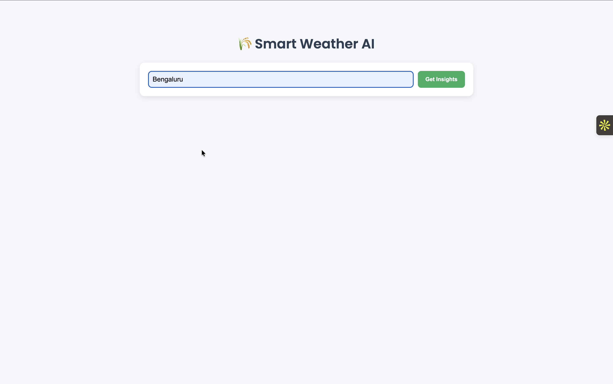
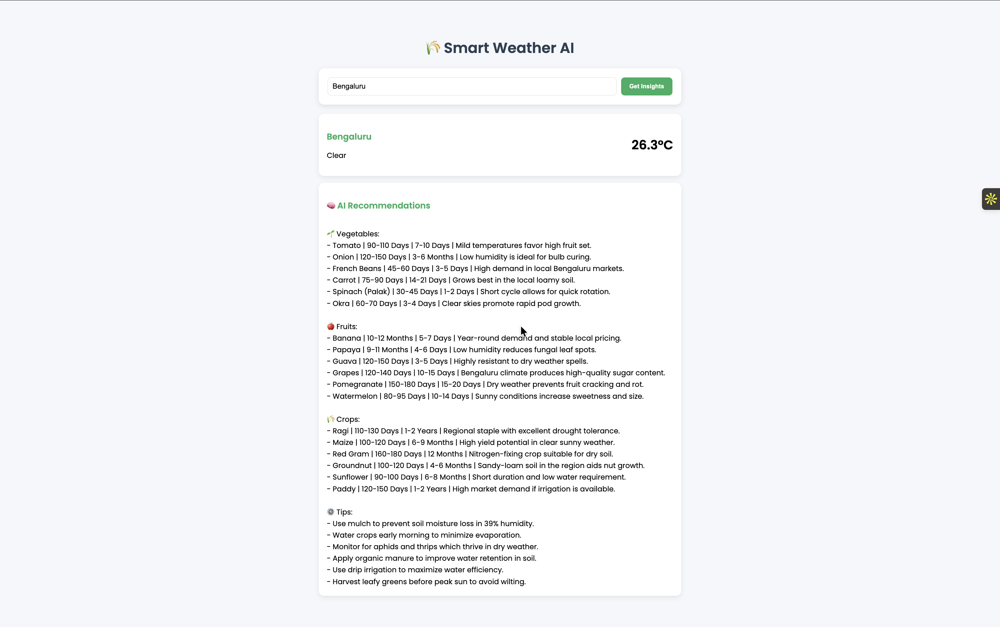

# 🌦️ Weather App

A modern **Weather Forecast Web Application** built using **Django** that provides real-time weather updates and intelligent insights using AI.

---

## 🚀 Features

* 🌍 Get real-time weather information
* 🌡️ Temperature, humidity, and conditions
* 🤖 AI-powered suggestions (via Google Generative AI)
* 🔍 User-friendly search interface
* 📱 Responsive design (works on mobile & desktop)
* ⚡ Fast and lightweight

---

## 🛠️ Tech Stack

* **Backend:** Django (Python)
* **Frontend:** HTML, CSS
* **Server:** Gunicorn
* **Deployment:** Render
* **AI Integration:** Google Generative AI API

---

## 📸 Screenshots




---

## ⚙️ Installation (Run Locally)

```bash
git clone https://github.com/yourusername/weather-app.git
cd weather-app
pip install -r requirements.txt
python manage.py migrate
python manage.py runserver
```

---

## 🌐 Live Demo

👉 https://weather-app-44mg.onrender.com/

---

## 🔐 Environment Variables

Create a `.env` file and add:

```
GOOGLE_API_KEY=your_api_key_here
SECRET_KEY=your_django_secret_key
```

---

## 📂 Project Structure

```
weather_app/
│
├── myapp/
├── weather_app/
├── static/
├── templates/
├── manage.py

```

---

## 🚧 Future Improvements

* 📊 Add 7-day forecast
* 📍 Auto-detect location
* 🌐 Multi-language support
* 📈 Weather charts & graphs

---

## 👨‍💻 Author

**A Vinay Kalyan Reddy**

---

